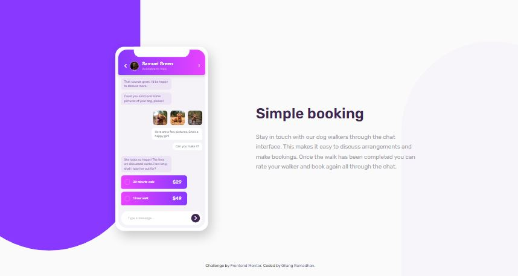

# Frontend Mentor - Chat app CSS illustration solution

This is a solution to the [Chat app CSS illustration challenge on Frontend Mentor](https://www.frontendmentor.io/challenges/chat-app-css-illustration-O5auMkFqY). Frontend Mentor challenges help you improve your coding skills by building realistic projects.

## Table of contents

- [Overview](#overview)
  - [The challenge](#the-challenge)
  - [Screenshot](#screenshot)
  - [Links](#links)
- [My process](#my-process)
  - [Built with](#built-with)
  - [What I learned](#what-i-learned)
- [Author](#author)

## Overview

### The challenge

Users should be able to:

- View the optimal layout for the component depending on their device's screen size
- **Bonus**: See the chat interface animate on the initial load

### Screenshot

### Links

- Solution URL: [solution URL here](https://www.frontendmentor.io/solutions/chat-app-css-illustration-lPd0wXGJWB)
- Live Site URL: [live site URL here](https://gilangr1440.github.io/chat-app-illustrations/)

## My process

### Built with

- Semantic HTML5 markup
- CSS custom properties
- Flexbox
- CSS Grid
- Mobile-first workflow
- SCSS
- BEM Notation

### What I learned

This is my first time implementing animation on this project.

## Author

- LinkedIn - [Gilang Ramadhan](https://www.linkedin.com/in/gilangr1440/)
- Frontend Mentor - [@gilangr1440](https://www.frontendmentor.io/profile/gilangr1440)
- Instagram - [@gilangr1440](https://www.instagram.com/gilangr1440)
